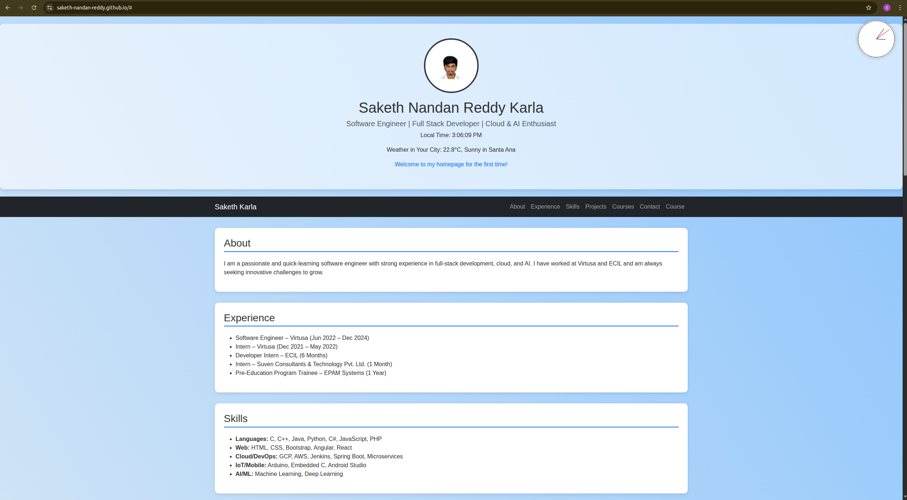
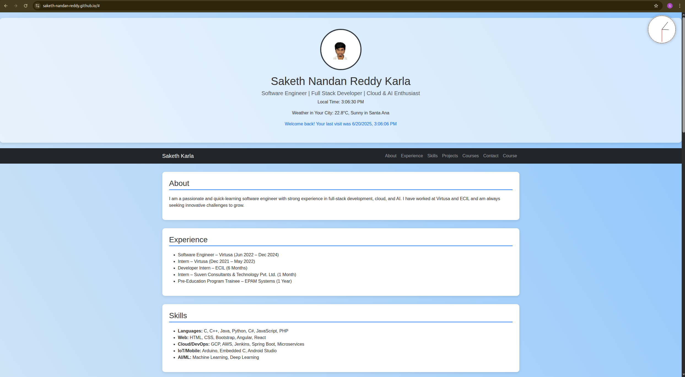
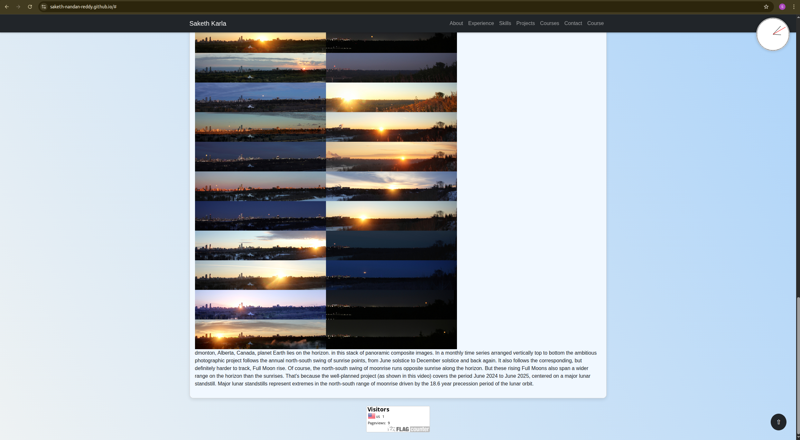
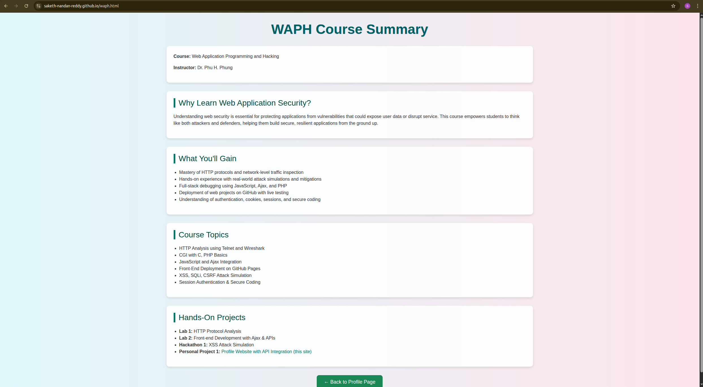

# WAPH-Web Application Programming and Hacking

## Instructor: Dr. Phu Phung

## Student

**Name**: Saketh Nandan Reddy Karla

**Email**: [karlas2@udayton.edu](mailto:karlas2@udayton.edu)

---

## Overview

This assignment focused on building and deploying a personal profile website using HTML, CSS (via Bootstrap), JavaScript, and public APIs. It demonstrates hands-on web development and client-side scripting skills.  

The project is deployed on GitHub Pages and includes API integrations, cookie-based visit tracking, responsive design, and professional styling suitable for a potential employer.

- **Live Website**: [https://saketh-nandan-reddy.github.io/](https://saketh-nandan-reddy.github.io/)
- **Project GitHub Repository**: [GitHub Repo](https://github.com/saketh-nandan-reddy/saketh-nandan-reddy.github.io)

---

## Task Summaries

### 1. Website Deployment
- Created a GitHub repository and enabled GitHub Pages.
- Uploaded all HTML, CSS, JS, and image assets.
- Ensured the homepage (`index.html`) loads correctly and links are working.

### 2. Personal Profile Webpage
- Designed with Bootstrap and custom styling.
- Includes personal information, contact, experiences, skills, and projects.
- Added navigation with a scroll-to-top button and fixed-top behavior on scroll.

### 3. WAPH Course Page (`waph.html`)
- Added a dedicated page introducing the course topics and hands-on projects.
- Linked it from the main profile page.
- Styled it to match the site theme with headers and custom backgrounds.

### 4. Digital and Analog Clocks
- Implemented a digital clock with JavaScript that updates every second.
- Built a canvas-based analog clock placed on the top-right of the screen.

### 5. Show/Hide Email
- Used a toggle button to show/hide email with JavaScript interaction.

### 6. Public API Integrations
- **Joke API**: Displays a random joke every 1 minute using `https://v2.jokeapi.dev/`.
- **NASA APOD API**: Fetches the Astronomy Picture of the Day with title and explanation.
- Added a disclaimer noting the content comes from third-party APIs.

### 7. Weather API
- Integrated WeatherAPI to detect the user's city and display real-time weather.

### 8. Cookie-based Visitor Tracking
- Implemented a JavaScript cookie to check if the visitor is new or returning.
- Shows a welcome message accordingly with last visit timestamp.

### 9. Analytics Tracker
- Embedded [FlagCounter](https://flagcounter.com) to track visitors on the site.

---

## Screenshots

  
**Homepage Screenshot** showing your name, headshot, and clock

  
**Cookie Inspector** (Browser Dev Tools) showing the cookie set.

  
**EMmail Inspector** Showing email.

  
**NASA Image** loaded with its description along with Visitor Message.

  
 **Course Page (`waph.html`)**

